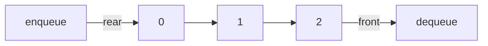
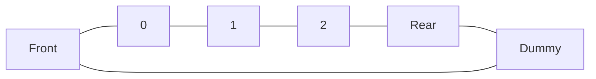

## Linear Queue

- **FIFO**
	- First-In-First-Out
	- 선입선출
- **연산**
	- push(), offer(), add()
		- 데이터 추가
	- pop(), poll()
		- 데이터 삭제
	- peek()
		- 가장 앞 데이터 검색
- **Queue를 배열로 구현한다면?**
	- 앞 데이터를 삭제하면 뒤 데이터를 앞으로 이동시켜야함 → 시간 복잡도가 $O(N)$이라 비효율
	- 따라서 Linked List로 구현

## Circular Queue

- **배열로 Queue를 구현했을 때의 단점을 보완**
	- 고정된 크기의 배열로 구현
- **isEmpty() 조건**
	- front == rear
- **isFull() 조건**
	- front == rear + 1
		- Dummy의 역할